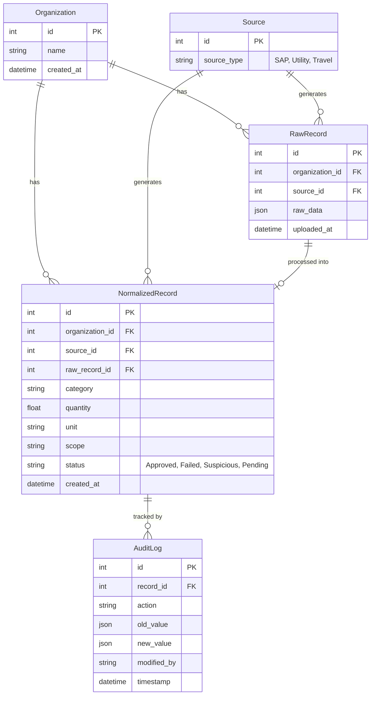

# BreatheESG - Project Architecture

## 1. System Architecture & Request Flow

The BreatheESG platform follows a decoupled client-server architecture:

**Entry Points:**
- **Frontend**: The user accesses the Single Page Application (SPA) built with React and Vite. The entry point is `frontend/src/main.tsx` which renders the `App` component.
- **Backend**: The server is built with Django (Python). The entry point for the server is `backend/config/wsgi.py` (or `asgi.py`), with request routing starting from `backend/config/urls.py`.

**Request Flow (Frontend to Backend):**
1. **User Interaction**: The user interacts with the React interface (e.g., uploading a CSV file or viewing a dashboard).
2. **Client-Side Processing**: The frontend state is managed using React Context (`AuthContext`, `OrganizationContext`). The frontend uses the `fetch` API (or Axios) to make HTTP requests to the backend.
3. **API Routing**: The Django backend receives the HTTP request at `/api/...`. The `config/urls.py` routes it to the `emissions` app (`emissions/urls.py`).
4. **Business Logic**: Django Views (`emissions/views.py`) handle the request. This involves authentication checks, validation, and invoking business logic (like normalizing ESG data).
5. **Data Layer**: The views interact with the SQLite database via Django ORM (`emissions/models.py`) to read or write data (e.g., saving a `RawRecord` and processing a `NormalizedRecord`).
6. **Response**: The backend serializes the data (`emissions/serializers.py`) and sends a JSON response back to the frontend.
7. **UI Update**: React updates the UI state based on the JSON response, re-rendering the relevant components.

---

## 2. File Structure

The repository is organized into distinct frontend and backend directories:

```text
BreatheESG/
├── backend/                  # Django REST API
│   ├── config/               # Project configuration (settings.py, root urls.py, wsgi/asgi)
│   ├── emissions/            # Main application logic
│   │   ├── migrations/       # Database schema migrations
│   │   ├── models.py         # Data models
│   │   ├── views.py          # API endpoint handlers
│   │   ├── urls.py           # Application routes
│   │   ├── serializers.py    # JSON serialization logic
│   │   └── admin.py          # Django admin configuration
│   ├── db.sqlite3            # SQLite database file
│   ├── manage.py             # Django CLI utility
│   └── pyproject.toml        # Python dependencies
├── frontend/                 # React SPA (Vite)
│   ├── public/               # Static assets
│   ├── src/                  # Source code
│   │   ├── components/       # Reusable UI components
│   │   ├── context/          # React Context (Auth, Organization)
│   │   ├── hooks/            # Custom React hooks
│   │   ├── pages/            # Page-level components (Dashboard, Upload, Review, Login)
│   │   ├── services/         # API integration layer
│   │   ├── App.tsx           # Main application layout and state routing
│   │   └── main.tsx          # React DOM mounting point
│   ├── package.json          # Node dependencies
│   └── vite.config.ts        # Vite configuration
└── README.md                 # Project documentation
```

---

## 3. Models Schema



---

## 4. Application Routes

### Frontend Routes (State-based Navigation)
The frontend utilizes a state-based tab routing mechanism within `App.tsx` (`activeTab`), rather than a traditional URL router like `react-router-dom`:
- **Login**: `pages/Login.tsx` (Visible when unauthenticated)
- **Dashboard**: `pages/Dashboard.tsx` (`activeTab === 'dashboard'`) - Sustainability Insights
- **Upload**: `pages/Upload.tsx` (`activeTab === 'upload'`) - Ingestion Hub
- **Review**: `pages/Review.tsx` (`activeTab === 'review'`) - Audit & Review

### Backend API Routes
Defined in `backend/emissions/urls.py` with the `/api/` prefix:

**Authentication:**
- `POST /api/auth/login/` - Obtain auth token
- `GET /api/auth/me/` - Get current user profile

**Data Ingestion (Uploads):**
- `POST /api/upload/sap/` - Upload SAP data
- `POST /api/upload/utility/` - Upload Utility data
- `POST /api/upload/travel/` - Upload Travel data

**Data Retrieval & Management:**
- `GET /api/records/` - List all records
- `GET /api/records/suspicious/` - List suspicious records
- `GET /api/records/approved/` - List approved records
- `POST /api/records/<id>/approve/` - Approve a record
- `POST /api/records/<id>/flag/` - Flag a record as suspicious
- `GET /api/audit/<id>/` - View audit logs for a specific record

---

## 5. Scalability Recommendations

To scale this application for a larger user base and heavier data loads, consider the following improvements:

1. **Database Migration**:
   - **Current**: SQLite (good for development, but locks on concurrent writes).
   - **Scale**: Migrate to a robust RDBMS like **PostgreSQL**. It supports high concurrency and advanced JSON querying (useful for the `raw_data` fields).

2. **Asynchronous Task Processing**:
   - **Current**: Data upload and normalization likely happen synchronously during the request cycle.
   - **Scale**: Implement a message broker (e.g., **Redis** or **RabbitMQ**) and a task queue (e.g., **Celery**). Move CSV parsing, validation, and normalization to background workers so large file uploads don't block the API.

3. **Caching**:
   - Dashboard aggregates can be computationally expensive. Use **Redis** or **Memcached** to cache frequent dashboard queries and invalidate them when new records are approved.

4. **Frontend Architecture**:
   - Introduce **React Router** for real URL-based routing instead of state-based tabs. This enables deep linking and better user experience.
   - Utilize static hosting (Vercel, AWS S3 + CloudFront) for the frontend assets, coupled with a CDN.

5. **Infrastructure Deployment**:
   - Containerize both frontend and backend using **Docker**.
   - Deploy backend using orchestration tools like **Kubernetes** or managed services like **AWS ECS** / **Render**, paired with load balancers to distribute traffic across multiple Django instances.
   - Serve static/media files through a dedicated storage service (like **AWS S3**) instead of the local filesystem.
