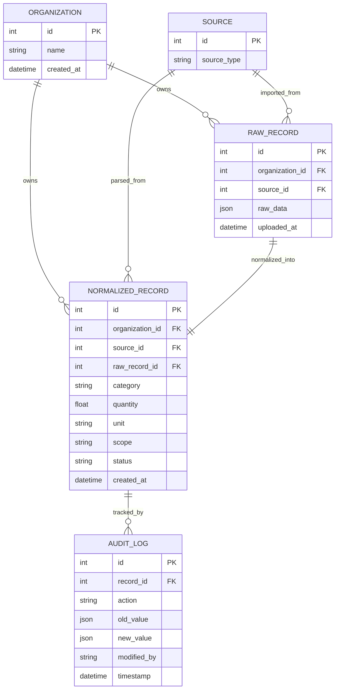

# Data Model Specification

## 1. Entity Relationship Overview

Our data model is designed to support high-throughput, multi-tenant enterprise ESG reporting. The database is partitioned cleanly across five core models:

---

## 2. Structural Pillars

### 2.1 Multi-Tenancy Architecture
* **Approach**: Shared Database, Shared Schema with Logical Row-Level Isolation (Tenant-Key partitioning).
* **Implementation**: Every record in the database—both raw uploads (`RawRecord`) and normalized outputs (`NormalizedRecord`)—is explicitly bound to a specific tenant via a foreign key reference to the `Organization` model.
* **Why**: Logical row-level isolation using `organization_id` offers the optimal balance between performance, database resource usage, and ease of schema migrations. In a production environment, this is enforced programmatically via Django managers or Global Filters to guarantee that no tenant can ever view or manipulate another tenant's environmental data.

### 2.2 Scope 1/2/3 Categorization
* **Approach**: Automated heuristic mapping based on the Greenhouse Gas (GHG) Protocol.
* **Implementation**: Managed by the unified `scope_mapper.py` utility. Incoming materials are normalized and categorized:
  * **Scope 1 (Direct Emissions)**: Direct fossil fuels burned on-site/in-company assets (e.g., `diesel`, `petrol`, `natural gas`, `coal`, `lubricant oil`).
  * **Scope 2 (Indirect Purchased Energy)**: Purchased electricity, heat, or steam (mapped automatically to `Scope 2`).
  * **Scope 3 (Other Indirect Value Chain)**: Corporate travel activity (flights, hotels, ground transport) and supply-chain procurement materials (cement, steel, copper).
* **Fallback Safety**: Any unknown material defaults conservatively to **Scope 3 (Procurement)**. This ensures that every parsed record carries a valid, auditable scope classification from the moment of ingestion.

### 2.3 Source-of-Truth Tracking & Lineage
* **Approach**: Two-tier ingestion pipeline (Raw Store vs. Normalized Store).
* **Implementation**: 
  * **`RawRecord`**: Stores the absolute, untouched original CSV row inside a Django `JSONField` (`raw_data`). This table is strictly **immutable** (no writes or edits are allowed after ingestion).
  * **Lineage Linking**: The `NormalizedRecord` carries a unique `raw_record_id` pointing directly back to the `RawRecord` it was parsed from.
* **Why**: If a compliance auditor questions an aggregated emission metric, the platform can trace any individual record back to the exact row in the raw spreadsheet that produced it, establishing an ironclad, tamper-proof audit trail.

### 2.4 Unit Normalization
* **Approach**: Standardized lookup mapping and scaling conversions.
* **Implementation**: Managed in `unit_mapper.py`:
  * All raw strings representing the same physical unit (e.g., `l`, `ltr`, `liter`, `liters`, `litres`) are mapped to their canonical singular string representation (e.g., `liter`).
  * Energy measurements are mathematically converted to a standard unit. For electricity data, consumption in Megawatt-hours (`MWh`) is dynamically scaled by a factor of `1,000` to register as Kilowatt-hours (`kWh`).
* **Why**: Unit standardization prevents computational errors (e.g., adding Liters to Gallons or kWh to MWh) when calculating carbon footprints, ensuring all aggregate analytics are mathematically consistent.

### 2.5 Detailed Audit Trail
* **Approach**: Fully auditable change logs.
* **Implementation**: Every administrative action taken on a `NormalizedRecord` (e.g., approving a record, flagging it as suspicious, or changing its status) creates an immutable row in the `AuditLog` table.
* **Change Capturing**: The `AuditLog` captures state changes by storing the pre-edit state (`old_value`) and post-edit state (`new_value`) as JSON payloads, alongside the actor's username (`modified_by`) and a precise `timestamp`.
* **Traceability**: Audit logs are exposed directly on the frontend review console, providing compliance officers with a full, visual timeline of who approved or flagged any emission record and why.
